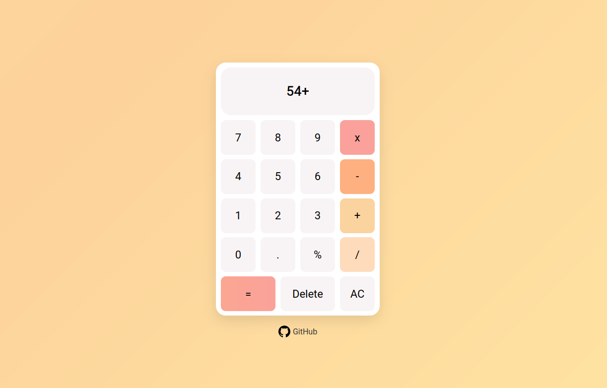

# Calculator Project

A visually appealing, fully functional calculator built using **HTML, CSS, and JavaScript**.  
This project was created as the **Final Project** for the [Odin Project: Foundations](https://www.theodinproject.com/paths/foundations) curriculum.

---

## Screenshot

<!-- Add your screenshot here -->

---

## Features

- Basic arithmetic operations: addition, subtraction, multiplication, and division  
- Percentage calculation (`%`)  
- Backspace (Delete) functionality  
- Clear all (AC) button  
- Smooth gradient animations for background and buttons  
- Responsive and interactive UI with hover effects  
- Error handling (e.g., division by zero alert)

---

## How to Use

1. Open `index.html` in a browser.  
2. Click numbers and operators to perform calculations.  
3. Press `=` to see the result.  
4. Use `Delete` to remove the last character.  
5. Use `AC` to reset the calculator.  

---

## To-Do List

- [x] Create functions for add, subtract, multiply, and divide
- [x] create normal calculations calculator
- [x] add iterative capability
- [x] hidden class
- [x] delete button
- [x] clear everything
- [x] percentage
- [x] Nice CSS
- [x] NEW README
---